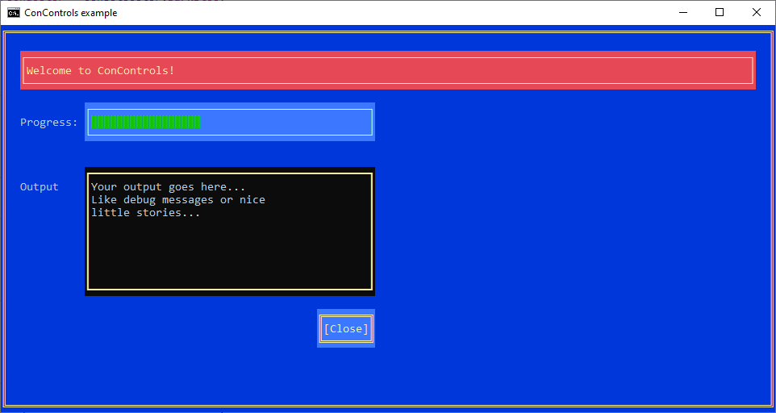

## Welcome

ConControls is a library that provides UI controls for a Windows console program.

The idea came up when we had to develop a bunch of test tools, for example to simulate a lot of clients accessing a web service. The tools
were too simple to take the effort of developing a UI with Windows Forms or WPF etc., but only writing results to stdout wasn't that comfortable either.

So we wanted something to create nice graphical outputs, but without needing to care about a complex UI design.  
Now: ConControls allows you to create things like labels and text blocks, progress bars and buttons in your conosle window.

The manual/how-to can be found [here](Manual.md).  
The API documentation is availalbe as a [Sandcastle](https://github.com/EWSoftware/SHFB) compiled html help file: [ConControls.chm](api/ConControls.chm).  
Examples can be found in the [ConControlsExamples](https://github.com/ReneVogt/ConControls/tree/master/Sources/ConControlsExamples) project in the sources.

[Release notes](ReleaseNotes.md)

---
Ren&eacute; Vogt  
Dresden 2020/05/29